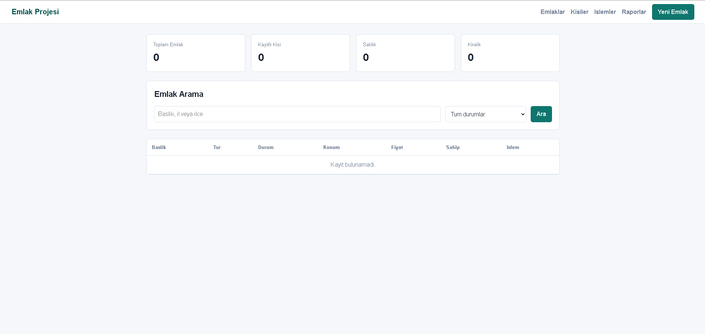
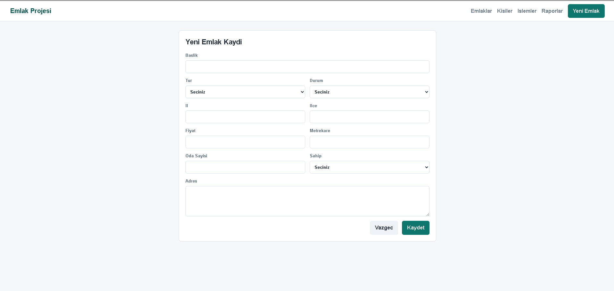
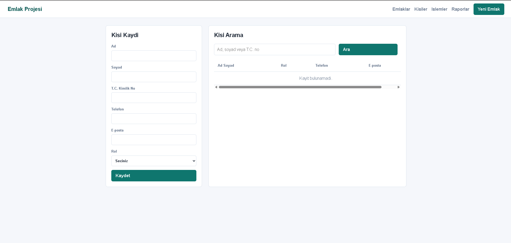
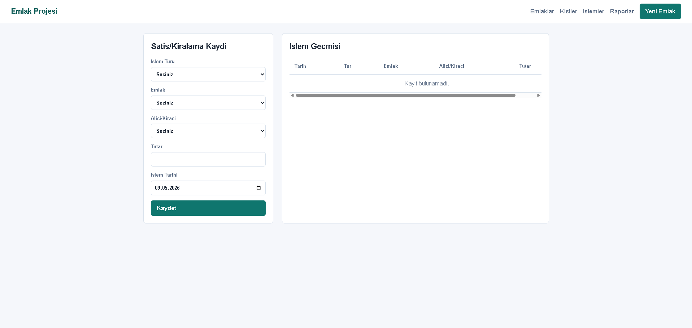
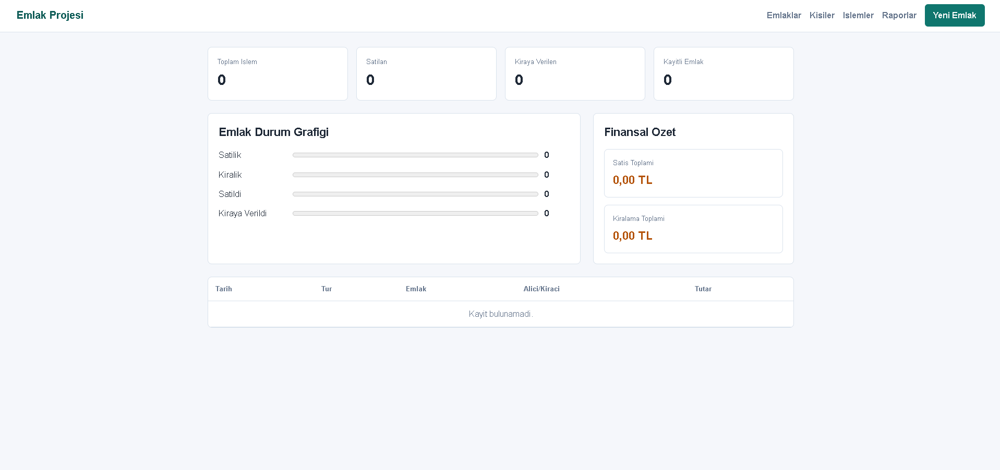

# Emlak Projesi

BT-KL-150 Java aday degerlendirme odevi icin hazirlanmis Spring Boot baslangic uygulamasi.

## Kapsam

- Kisi kaydi: alan, satan, kiraci, kiraya veren rolleri
- Emlak kaydi: tur, durum, konum, fiyat, metrekare, oda sayisi, sahip bilgisi
- Emlak arama: baslik, il, ilce ve durum filtresi
- Satis/kiralama islemi: emlak ile alici/kiraci eslestirme ve emlak durumunu guncelleme
- Raporlama ve grafik: emlak durum grafigi, islem sayilari, satis/kiralama tutar ozetleri
- HTML5, CSS ve JavaScript tabanli Thymeleaf ekranlari
- JPA tabanli veri modeli
- Gelistirme icin PostgreSQL veritabani

## Isverene Sunulacak Calisma Ozeti

Bu proje, emlak satis ve kiralama sureclerini yonetmek icin Java 8 ve Spring Boot 2.7.18 ile hazirlanmis calisir bir web uygulamasidir. Uygulama; kisi yonetimi, emlak kaydi, arama, satis/kiralama islemleri ve raporlama ihtiyaclarini tek bir arayuzde toplar.

Projede yapilan baslica isler:

- Spring Boot MVC mimarisi kuruldu; controller, service, repository ve domain katmanlari ayrildi.
- Kisi kayit ekrani hazirlandi; alan, satan, kiraci ve kiraya veren rolleri sisteme eklendi.
- Emlak kayit yapisi olusturuldu; konut/isyeri/arsa gibi turler, satis/kiralama durumu, konum, fiyat ve fiziksel bilgiler tutulabilir hale getirildi.
- Ana sayfada emlak arama ve filtreleme gelistirildi; baslik, il, ilce ve emlak durumuna gore listeleme yapilabilir.
- Satis ve kiralama islem akisi eklendi; emlak ile alici veya kiraci eslestirilir ve islem tamamlandiginda emlak durumu otomatik olarak `SOLD` ya da `RENTED` olarak guncellenir.
- Raporlama ekrani hazirlandi; toplam emlak, kisi ve islem sayilari ile satis/kiralama tutar ozetleri gosterilir.
- Grafik destekli dashboard mantigi eklendi; emlak durum dagilimlari kullaniciya gorsel olarak sunulur.
- Form dogrulamalari Bean Validation ile eklendi; zorunlu alanlar ve hatali girisler icin kullaniciya mesaj verilir.
- Thymeleaf, HTML5, CSS ve JavaScript ile kullanilabilir web ekranlari tasarlandi.
- Spring Data JPA ve Hibernate ile iliskisel veri modeli kuruldu.
- Gelistirme ortaminda PostgreSQL veritabani kullanilacak sekilde ayarlandi.
- PDF gereksinimlerine gore karsilanan maddeler `docs/requirements-checklist.md` dosyasinda ayrica belgelendi.

## Ekran Goruntuleri

### Emlaklar



### Yeni Emlak Kaydi



### Kisiler



### Islemler



### Raporlar



## Kullanilan Teknolojiler

- Java 8
- Spring Boot 2.7.18
- Spring MVC
- Spring Data JPA / Hibernate
- Thymeleaf
- Bean Validation
- PostgreSQL
- PostgreSQL JDBC Driver
- Maven
- HTML5, CSS, JavaScript

## Calistirma

Bu proje Java 8 uyumlu Spring Boot 2.7.18 ile ayarlandi.

Maven PATH'te varsa:

```powershell
mvn spring-boot:run
```

IntelliJ IDEA kullaniliyorsa:

1. Projeyi Maven projesi olarak yeniden yukleyin.
2. `com.emlakprojesi.EmlakProjesiApplication` sinifini calistirin.
3. Uygulamayi `http://localhost:8080` adresinden acin.

Uygulama varsayilan olarak lokal PostgreSQL uzerindeki `emlakdb` veritabanina baglanir:

```text
jdbc:postgresql://localhost:5432/emlakdb
User: postgres
Password: postgres
```

PostgreSQL'de veritabani yoksa once olusturun:

```sql
CREATE DATABASE emlakdb;
```

Farkli baglanti bilgileri icin ortam degiskenleri kullanilabilir:

```powershell
$env:DB_URL="jdbc:postgresql://localhost:5432/emlakdb"
$env:DB_USERNAME="postgres"
$env:DB_PASSWORD="postgres-sifreniz"
mvn spring-boot:run
```

## Gereksinim Kontrolu

PDF'e gore karsilanan maddeler `docs/requirements-checklist.md` dosyasinda ozetlenmistir.
